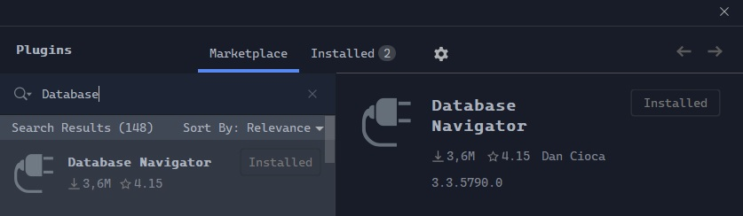
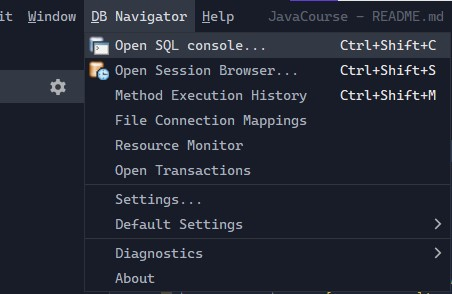
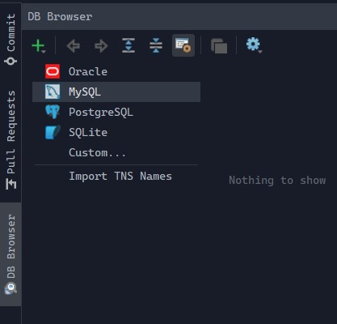

# Java Course (JVM)

## Branches Are Used As Folders

|    Quiz    |                                     Branch                                     |
| :--------: | :----------------------------------------------------------------------------: |
|   Quiz 1   |              [Quiz1](https://github1s.com/xHacka/Java/tree/Quiz1)              |
|   Quiz 4   |              [Quiz4](https://github1s.com/xHacka/Java/tree/Quiz4)              |
| Lecture 5  |       [Lecture5-XML](https://github1s.com/xHacka/Java/tree/Lecture5-XML)       |
| Lecture 7  |   [Lecture7-Sockets](https://github1s.com/xHacka/Java/tree/Lecture7-Sockets)   |
| Lecture 8  | [Lecture8-StreamAPI](https://github1s.com/xHacka/Java/tree/Lecture8-StreamAPI) |
| Lecture 10 |    [Lecture10-MySQL](https://github1s.com/xHacka/Java/tree/Lecture10-MySQL)    |

## How To Use

```
git clone https://github.com/xHacka/Java.git
git switch {Branch}
```

## Connect To Database

1. Download `Database Navigator` Plugin (Community Edition Doesn't Come With The Tool)
   <br><small>`Ctrl+Alt+S -> Open Settings`</small>
   
2. Open `Database Navigator`
   <br><small>`Ctrl+Alt+C -> Open DB Navigator`</small>
   
3. Create New Connection To MySQL
   <br>After Setup You Can Find `url` In `Info` (Refer To `JDBCUtil.java`)
   
4. Fill The Necessary Information From `MySQLDAtabase.txt`
   <br><small>*You Have Admin Rights But Don't Go Overboard*</small>