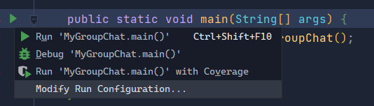
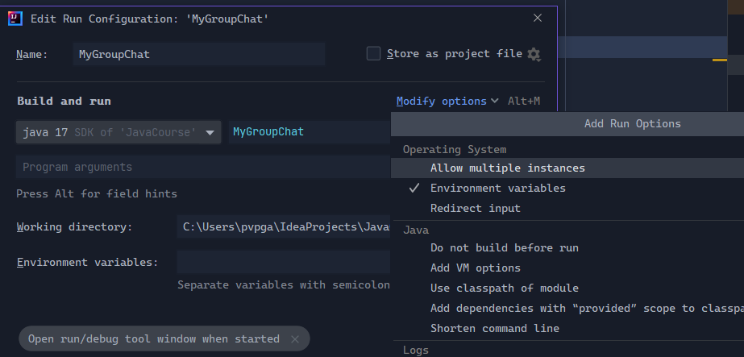
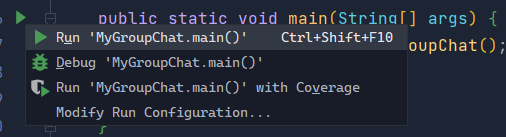

# Java Course (JVM)

## Branches Are Used As Folders

|  Quiz  | Branch |
|:------:|:------:|
| Quiz 1 |  [Quiz1](https://github1s.com/xHacka/Java/tree/Quiz1) |
|Lecture 5| [Lecture5-XML](https://github1s.com/xHacka/Java/tree/Lecture5-XML)|
|Lecture 7| [Lecture7-Sockets](https://github1s.com/xHacka/Java/tree/Lecture5-XML)|

## How To Use

```
git clone https://github.com/xHacka/Java.git
git fetch
git switch {Branch}
```

## Run One Way Communication

- First Run The Server Then The Client. (Can Handle Only One Instance)

## Group Chat

1. Click Run (Triangle) And Choose **Modify Run Configuration...**

2. Click **Modify options** And Toggle **Allow multiple instances**

3. Run Multiple Instances Of Program
