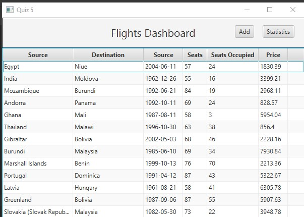

# Java Course (JVM)

## Branches Are Used As Folders

|    Quiz    |                                     Branch                                     |
| :--------: | :----------------------------------------------------------------------------: |
|   Quiz 1   |              [Quiz1](https://github1s.com/xHacka/Java/tree/Quiz1)              |
|   Quiz 4   |              [Quiz4](https://github1s.com/xHacka/Java/tree/Quiz4)              |
|   Quiz 5   |              [Quiz5](https://github1s.com/xHacka/Java/tree/Quiz5)              |
| Lecture 5  |       [Lecture5-XML](https://github1s.com/xHacka/Java/tree/Lecture5-XML)       |
| Lecture 7  |   [Lecture7-Sockets](https://github1s.com/xHacka/Java/tree/Lecture7-Sockets)   |
| Lecture 8  | [Lecture8-StreamAPI](https://github1s.com/xHacka/Java/tree/Lecture8-StreamAPI) |
| Lecture 10 |    [Lecture10-MySQL](https://github1s.com/xHacka/Java/tree/Lecture10-MySQL)    |
| Lecture 11 |    [Lecture11-JavaFX](https://github1s.com/xHacka/Java/tree/Lecture11-JavaFX)    |

## How To Use

```
git clone https://github.com/xHacka/Java.git
git switch {Branch}
```

# How To Run Application

1. Install Dependencies Via Maven (pom.xml)
2. Run MainApplication.java
3. Enjoy<sub>?</sub>

## Features

1. In Application You Can See Flights Data In Tabular Format


2. Add Button
    - Add Custom Flight
    - Generate `n` Random Records
3. Statistics Button
    - Displays Barchart Data Based On Countries And Flights
4. Right Click On Row
    - Shows Context Menu To Delete Row (With Confirmation) 
